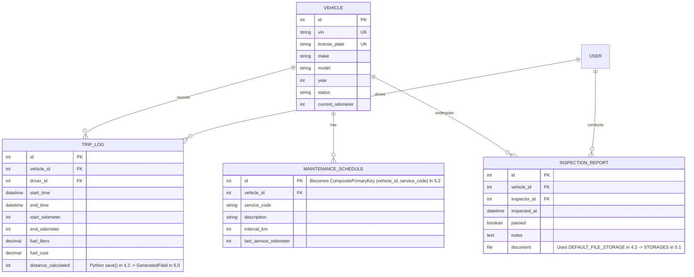

# FleetPulse — System Architecture & Implementation Design

This document details the software architecture, domain models, REST API design, and frontend integration strategy for FleetPulse.

---

## 1. Domain Architecture & Core Data Models

The system is organized into three bounded contexts: **Vehicles**, **Trips**, and **Maintenance**.

---

## 2. API & Frontend Integration (Django + Angular)

FleetPulse supports both traditional server-rendered templates and a decoupled Angular Single-Page Application (SPA):

### A. Django REST Framework API Layer
- `/api/v1/vehicles/`: CRUD operations for vehicle records with facet filtering (by status, make, mileage).
- `/api/v1/trips/`: Trip submission, odometer validation, and mileage aggregation endpoints.
- `/api/v1/maintenance/`: Scheduled work orders and inspection document uploads.
- `/api/v1/auth/`: Token-based or session-based authentication for drivers and fleet managers.

### B. Angular Frontend Application
- **Role**: Client application tailored for mobile drivers (trip start/stop, pre-trip vehicle checklist, photo upload) and fleet managers (interactive real-time dashboards).
- **Communication**: Angular `HttpClient` communicates with Django's REST endpoints over JSON.
- **CORS & CSRF**: Django `django-cors-headers` middleware configured with `django.middleware.csrf.CsrfViewMiddleware` to safeguard API requests.

---

## 3. Database Strategy
- **Development**: Local SQLite engine (`django.db.backends.sqlite3`) for fast iteration.
- **Production**: PostgreSQL (`django.db.backends.postgresql`), which fully supports Django 5.x database features (`Field.db_default`, `GeneratedField`, and connection pooling in 5.1).
